# chat-pane

<!-- Auto Generated Below -->

## Properties

| Property                     | Attribute  | Description | Type                              | Default                  |
| ---------------------------- | ---------- | ----------- | --------------------------------- | ------------------------ |
| `mapInputTextToHtmlElements` | --         |             | `(text: string) => HTMLElement[]` | `createElementsFromText` |
| `triangle`                   | `triangle` |             | `"bottom" \| "none" \| "top"`     | `'bottom'`               |

## Events

| Event      | Description | Type                               |
| ---------- | ----------- | ---------------------------------- |
| `incoming` |             | `CustomEvent<IncomingEventDetail>` |

## Methods

### `addButton({ text, action }: { text: string; action: () => any; }) => Promise<HTMLElement>`

#### Parameters

| Name  | Type                                   | Description |
| ----- | -------------------------------------- | ----------- |
| `__0` | `{ text: string; action: () => any; }` |             |

#### Returns

Type: `Promise<HTMLElement>`

### `addCard({ text, image }: { text?: string; image?: string; }) => Promise<HTMLElement>`

#### Parameters

| Name  | Type                                 | Description |
| ----- | ------------------------------------ | ----------- |
| `__0` | `{ text?: string; image?: string; }` |             |

#### Returns

Type: `Promise<HTMLElement>`

### `addIncomingMessage(text: string) => Promise<HTMLChatMessageElement>`

#### Parameters

| Name   | Type     | Description |
| ------ | -------- | ----------- |
| `text` | `string` |             |

#### Returns

Type: `Promise<HTMLChatMessageElement>`

### `addOutgoingMessage(text: string) => Promise<HTMLChatMessageElement>`

#### Parameters

| Name   | Type     | Description |
| ------ | -------- | ----------- |
| `text` | `string` |             |

#### Returns

Type: `Promise<HTMLChatMessageElement>`

### `scrollToBottom() => Promise<void>`

#### Returns

Type: `Promise<void>`

## Dependencies

### Depends on

- [chat-message](../message)
- ion-card
- ion-card-content
- ion-button
- ion-content
- [chat-settings](../settings)
- ion-header
- [prompt-picker](../prompt-picker)
- [chat-conversation](../conversation)
- ion-footer
- [chat-input](../input)

### Graph

```mermaid
graph TD;
  chat-pane --> chat-message
  chat-pane --> ion-card
  chat-pane --> ion-card-content
  chat-pane --> ion-button
  chat-pane --> ion-content
  chat-pane --> chat-settings
  chat-pane --> ion-header
  chat-pane --> prompt-picker
  chat-pane --> chat-conversation
  chat-pane --> ion-footer
  chat-pane --> chat-input
  chat-message --> ion-item
  chat-message --> chat-message-status
  ion-item --> ion-icon
  ion-item --> ion-ripple-effect
  ion-item --> ion-note
  chat-message-status --> ion-icon
  chat-message-status --> chat-check-mark
  ion-card --> ion-ripple-effect
  ion-button --> ion-ripple-effect
  chat-settings --> ion-card
  chat-settings --> ion-card-content
  chat-settings --> ion-item
  chat-settings --> ion-input
  chat-settings --> ion-label
  chat-settings --> ion-select
  chat-settings --> ion-select-option
  chat-settings --> ion-range
  chat-settings --> ion-toggle
  ion-input --> ion-icon
  ion-select --> ion-select-popover
  ion-select --> ion-popover
  ion-select --> ion-action-sheet
  ion-select --> ion-alert
  ion-select --> ion-icon
  ion-select-popover --> ion-item
  ion-select-popover --> ion-checkbox
  ion-select-popover --> ion-radio-group
  ion-select-popover --> ion-radio
  ion-select-popover --> ion-list
  ion-select-popover --> ion-list-header
  ion-select-popover --> ion-label
  ion-popover --> ion-backdrop
  ion-action-sheet --> ion-backdrop
  ion-action-sheet --> ion-icon
  ion-action-sheet --> ion-ripple-effect
  ion-alert --> ion-ripple-effect
  ion-alert --> ion-backdrop
  ion-toggle --> ion-icon
  prompt-picker --> ion-item
  prompt-picker --> ion-label
  prompt-picker --> ion-select
  prompt-picker --> ion-select-option
  chat-conversation --> ion-content
  chat-conversation --> ion-list
  chat-input --> ion-item
  chat-input --> ion-textarea
  chat-input --> ion-icon
  style chat-pane fill:#f9f,stroke:#333,stroke-width:4px
```

----------------------------------------------

*Built with [StencilJS](https://stenciljs.com/)*
