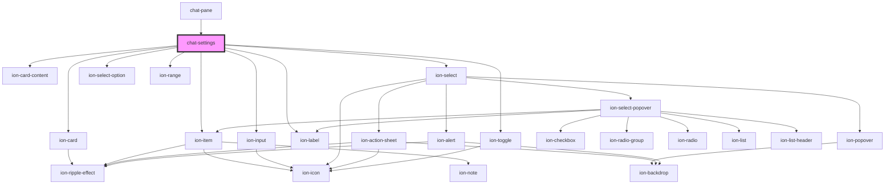

# chat-settings

<!-- Auto Generated Below -->

## Methods

### `getSettings() => Promise<{ llmServerAddress: string; selectedModel: string; temperature: number; jsonWebToken: string; stream: boolean; }>`

#### Returns

Type: `Promise<{ llmServerAddress: string; selectedModel: string; temperature: number; jsonWebToken: string; stream: boolean; }>`

## Dependencies

### Used by

 - [chat-pane](../pane)

### Depends on

- ion-card
- ion-card-content
- ion-item
- ion-input
- ion-label
- ion-select
- ion-select-option
- ion-range
- ion-toggle

### Graph

----------------------------------------------

*Built with [StencilJS](https://stenciljs.com/)*
